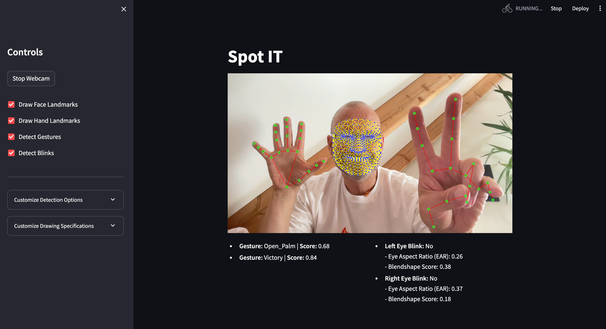

# SpotIT

SpotIT is a real-time computer vision application that demonstrates the use of [MediaPipe](https://github.com/google-ai-edge/mediapipe) and [OpenCV](https://opencv.org/) for gesture recognition and blink detection. The web interface is built with [Streamlit](https://streamlit.io/).

## Features

- **Real-time Gesture Recognition:** Detects various hand gestures using MediaPipe.
- **Blink Detection:** Detects eye blinks and calculates Eye Aspect Ratio (EAR) and blendshape scores.
- **Customizable Interface:** Options to toggle the display of face and hand landmarks.
  


## Installation

To install the necessary dependencies, run:

```bash
pip install -r requirements.txt
```

## Usage

To start the application, run:

```bash
streamlit run streamlit_app.py
```

This will open the application in your default web browser.

## Changelog

- 2024-06-26
  - Initial commit

## License

This project is licensed under the MIT License.